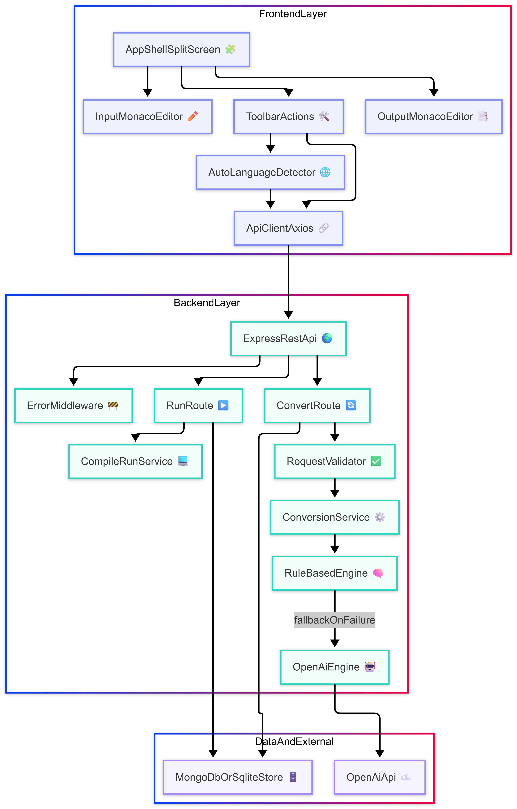
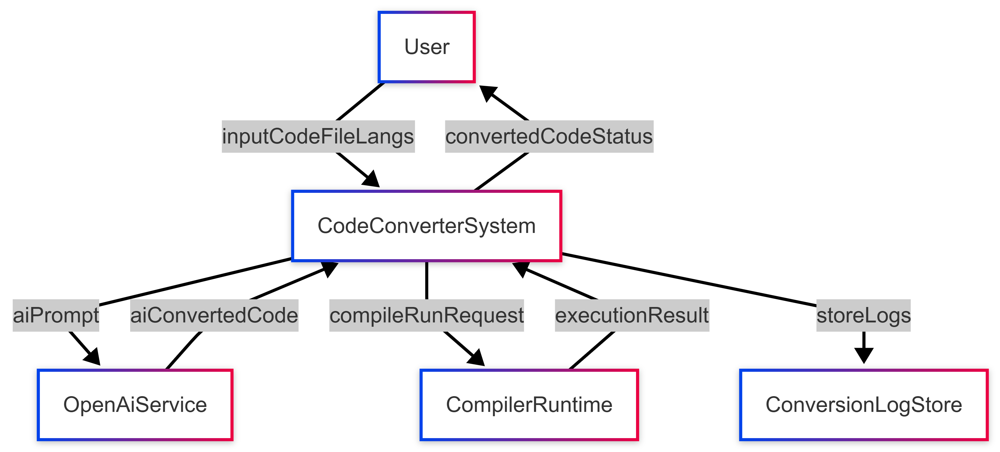
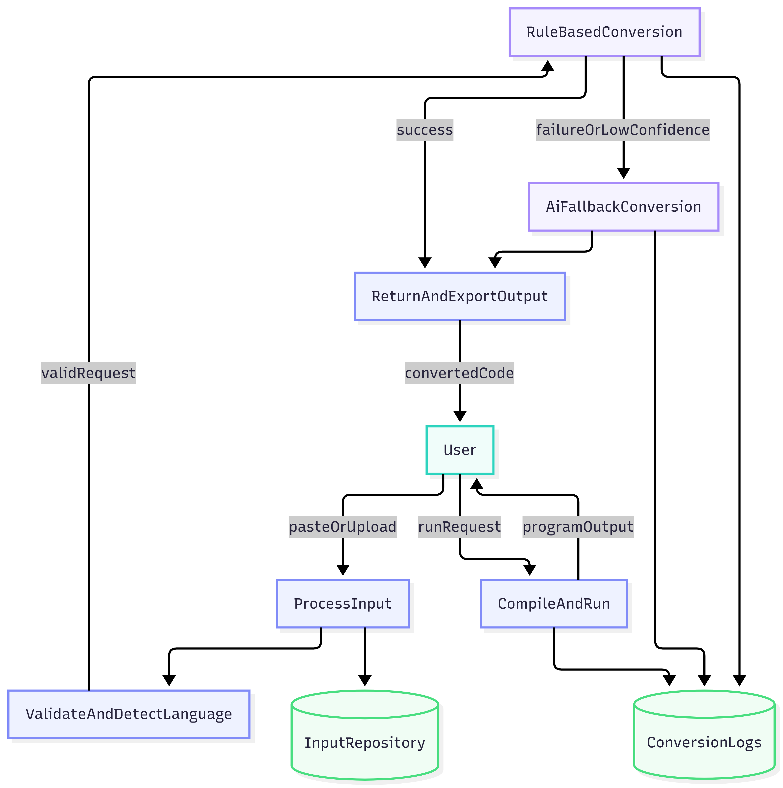
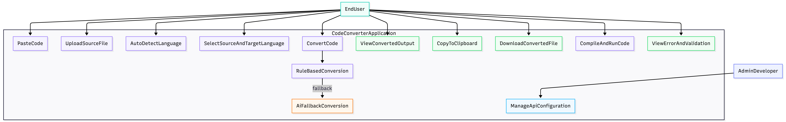
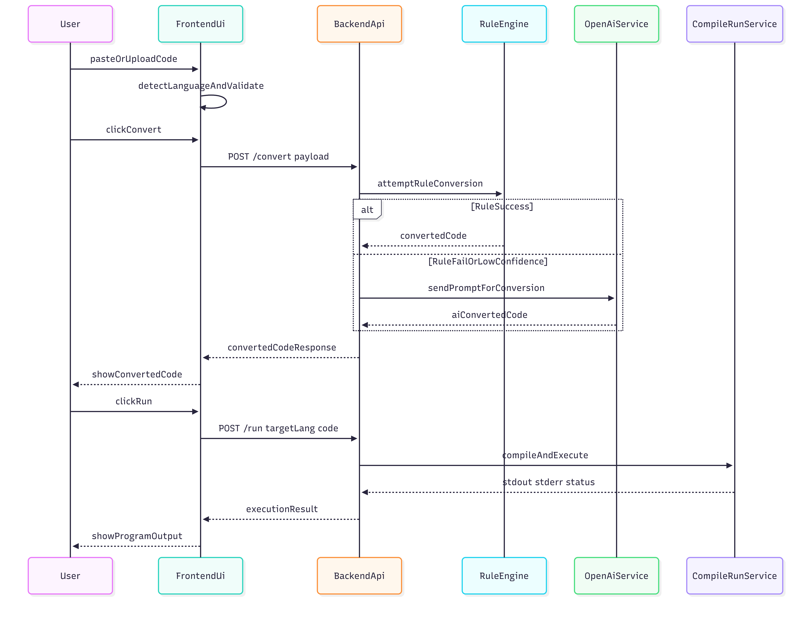

# AI-Powered Code Converter Web Application  
## Final Year Project Report

---

> Word export tip: This report includes `\newpage` markers for clean section breaks when converted to `.docx` using tools like Pandoc/Typora, or when manually formatting in MS Word.

> Diagram export tip: Place rendered diagram image files in an `images/` folder beside this document using these exact names: `system-architecture.png`, `dfd-level-0.png`, `dfd-level-1.png`, `use-case-diagram.png`, `sequence-diagram.png`.

## 1. Title Page

**Project Title:** AI-Powered Code Converter Web Application  
**Submitted by:** _[Student Name]_  
**Register Number:** _[University Register Number]_  
**Degree:** Bachelor of Engineering / Technology  
**Department:** Computer Science and Engineering  
**Institution:** _[College Name]_  
**University:** _[University Name]_  
**Academic Year:** 2025-2026  
**Project Guide:** _[Guide Name, Designation]_  

---

## 2. Certificate Page
\newpage

This is to certify that the project report entitled **"AI-Powered Code Converter Web Application"** is a bona fide work carried out by **_[Student Name]_** in partial fulfillment of the requirements for the award of the degree of **Bachelor of Engineering / Technology in Computer Science and Engineering** during the academic year **2025-2026**.

The work embodied in this report has not been submitted to any other university or institution for the award of any degree or diploma.

**Project Guide Signature:** ____________________  
**Head of Department Signature:** ____________________  
**External Examiner Signature:** ____________________  
**Date:** ____________________  
**Place:** ____________________  

---

## 3. Acknowledgement
\newpage

I express my sincere gratitude to my project guide, **_[Guide Name]_**, for continuous guidance, motivation, and support throughout this project. I thank the **Head of the Department**, faculty members, and laboratory staff for providing the required facilities and technical assistance.

I also thank my friends and family for their encouragement and support during the development and documentation phases of this project.

---

## 4. Abstract
\newpage

This project presents the design and implementation of a **full-stack AI-powered Code Converter web application** that transforms source code across multiple programming languages, specifically **Python, Java, C, and JavaScript**. The system combines a **rule-based conversion engine** with an **AI fallback strategy** powered by the OpenAI API.  

The conversion pipeline first applies deterministic syntax mapping for common constructs such as loops, conditions, functions, and print statements. If the rule-based engine cannot confidently produce a correct conversion, the system automatically invokes an AI model to generate semantically equivalent target code.  

The application includes a modern split-screen editor using Monaco, file upload, code paste input, automatic language detection, compile-and-run support, and downloadable output. The backend is developed with Node.js and Express, while the frontend uses React with Vite and Tailwind CSS.  

This hybrid approach improves reliability, speed, and conversion quality. The project demonstrates practical integration of software engineering principles, compiler-inspired transformations, and generative AI in a user-friendly development tool.

---

## 5. Table of Contents
\newpage

1. Title Page  
2. Certificate Page  
3. Acknowledgement  
4. Abstract  
5. Table of Contents  
6. Introduction  
7. Problem Statement  
8. Objectives  
9. Scope of the Project  
10. Literature Survey  
11. System Architecture  
12. Data Flow Diagram (Level 0 and Level 1)  
13. Use Case Diagram  
14. Sequence Diagram  
15. Methodology  
16. Technologies Used  
17. Implementation Details  
18. Algorithms / ML Approach  
19. UI/UX Design Explanation  
20. Testing  
21. Results and Output Screens Description  
22. Advantages and Limitations  
23. Future Scope  
24. Conclusion  
25. References  

---

## 6. Introduction
\newpage

Programming languages differ in syntax, idioms, runtime behavior, and standard libraries. Developers often need to migrate code between languages due to performance constraints, platform requirements, learning purposes, or modernization initiatives. Manual conversion is time-consuming and error-prone.

The proposed AI-powered code converter addresses this problem through an interactive web interface and hybrid backend conversion mechanism. The system supports:

- Input through code paste or file upload
- Source and target language selection
- Automatic language detection
- Rule-based and AI-assisted code conversion
- Compile-and-run functionality
- Output download and clipboard copy

The platform is designed for students, educators, and developers who require quick and reliable code translation assistance.

---

## 7. Problem Statement
\newpage

Existing code conversion tools either:

- Rely only on rigid syntax rules and fail on complex logic, or
- Depend fully on AI, which may introduce inconsistent outputs and higher response latency/cost.

There is a need for a practical system that combines deterministic conversion for common patterns with intelligent fallback for complex cases, while providing a clean user interface and operational developer features such as upload, run, and export.

---

## 8. Objectives
\newpage

The major objectives of this project are:

- To build a full-stack web application for code conversion
- To support conversion among Python, Java, C, and JavaScript
- To implement automatic language detection from input code/file extension
- To design a hybrid conversion engine (rule-based first, AI fallback)
- To provide compile-and-run support for quick validation
- To create a split-screen coding UI with syntax highlighting
- To include robust error handling, loading indicators, and validation
- To deliver a production-ready modular architecture

---

## 9. Scope of the Project
\newpage

### In Scope

- Multi-language code conversion (Python, Java, C, JavaScript)
- Upload `.py`, `.java`, `.c`, `.js` files
- Paste input directly into editor
- Hybrid conversion flow
- Compile and run converted code in controlled execution context
- Download converted output
- Basic test coverage and API validation

### Out of Scope

- Full semantic equivalence guarantee for every edge case
- Conversion of framework-specific project structures
- Stateful debugging and step-through execution
- Production cloud deployment and enterprise authentication

---

## 10. Literature Survey
\newpage

### 10.1 Rule-Based Translation

Classical source-to-source translators and transpilers use grammar rules, tokenization, and AST transformations. They are fast and deterministic but limited when handling non-trivial language idioms and context-dependent logic.

### 10.2 Compiler and Transpiler Concepts

Compilers perform lexical analysis, parsing, semantic checks, optimization, and code generation. Modern transpilers (for example, Babel-type systems) map high-level constructs between related languages while preserving behavior.

### 10.3 AI-Based Code Generation

Recent transformer-based models (Codex, CodeBERT-family approaches, GPT models) can perform context-aware code synthesis and translation. They are strong at semantic adaptation but may generate hallucinations without constraints.

### 10.4 Hybrid Approaches

Research and practical tools indicate that combining symbolic rules with neural generation improves robustness and cost efficiency. Rule engines resolve common cases cheaply; AI handles difficult patterns.

### 10.5 Gap Identified

Many tools are either too rigid or too stochastic. A balanced web application with end-user workflow features (upload, run, download, editor UX) remains highly useful in academic and practical settings.

---

## 11. System Architecture
\newpage

The system follows a client-server architecture with modular services.

- **Client Layer:** React + Monaco for rich editing and controls
- **API Layer:** Express REST endpoint for conversion and run requests
- **Conversion Layer:** Rule engine plus AI fallback service
- **Execution Layer:** Controlled compile/run sandbox process
- **Persistence Layer (Optional):** Database for logs/history



**Figure 1:** System Architecture of the AI-Powered Code Converter.

---

## 12. Data Flow Diagram (DFD - Level 0 and Level 1)
\newpage

### 12.1 DFD Level 0 (Context Diagram)



**Figure 2:** DFD Level 0 (Context Diagram).

### 12.2 DFD Level 1



**Figure 3:** DFD Level 1 for internal conversion and execution flow.

---

## 13. Use Case Diagram
\newpage



**Figure 4:** Use Case Diagram showing user and administrator interactions.

---

## 14. Sequence Diagram
\newpage



**Figure 5:** Sequence Diagram for conversion and compile-run operations.

---

## 15. Methodology
\newpage

The project follows an iterative software engineering lifecycle:

1. **Requirement Analysis**
   - Functional and non-functional requirements defined
2. **System Design**
   - Modular frontend and backend architecture
3. **Development**
   - UI components, API, conversion services, run engine
4. **Testing**
   - Unit, integration, and system testing
5. **Refinement**
   - Error handling, UX improvements, performance tuning
6. **Documentation**
   - Complete report and usage guide

Development process used Agile-style short iterations to validate each feature incrementally.

---

## 16. Technologies Used
\newpage

### 16.1 Frontend

- React (Vite)
- Tailwind CSS
- Monaco Editor
- Axios

### 16.2 Backend

- Node.js
- Express.js
- dotenv
- CORS, Helmet, Morgan

### 16.3 Database

- MongoDB (preferred for conversion logs/history)  
  or  
- SQLite (lightweight local persistence alternative)

### 16.4 AI Tools

- OpenAI API (LLM-based code translation fallback)

### 16.5 Development Tools

- Git and GitHub
- Postman / Thunder Client
- VS Code / Cursor IDE

---

## 17. Implementation Details
\newpage

### 17.1 Frontend Modules

- **Split-screen layout:** Left input and right output panels
- **Language selectors:** Source and target language dropdowns
- **Upload module:** Reads supported files and populates editor
- **Action controls:** Convert, Run, Copy, Download buttons
- **State handling:** Loading, success, error, validation states

### 17.2 Backend Modules

- `POST /convert`
  - Validates payload
  - Executes hybrid conversion pipeline
- `POST /run`
  - Compiles/interprets target code safely
  - Returns stdout/stderr

### 17.3 Conversion Service

- Language normalization and mapping
- Rule confidence scoring
- AI fallback when rule result is partial or failed

### 17.4 Compile and Run Service

- Creates temporary files per language
- Invokes compiler/interpreter commands in controlled process
- Applies timeout and output limits for safety

---

## 18. Algorithms / ML Approach (Rule-Based + AI Fallback)
\newpage

### 18.1 Rule-Based Conversion Algorithm

1. Tokenize and inspect source code patterns
2. Match known constructs:
   - loop structures
   - function signatures
   - conditional branches
   - print/output statements
3. Apply mapping templates for target language
4. Evaluate conversion confidence
5. If confidence is sufficient, return converted code

### 18.2 AI Fallback Algorithm

1. Build strict prompt with:
   - source language
   - target language
   - constraints to output only code
2. Send request to OpenAI API
3. Parse response and sanitize output
4. Return converted result to client

### 18.3 Hybrid Decision Policy

- `if ruleConversion.success && confidence >= threshold` -> use rule output
- `else` -> call AI fallback

### 18.4 Rationale

- Rule engine provides speed, consistency, and lower cost
- AI handles semantic complexity and edge-case patterns
- Hybrid model balances precision and flexibility

---

## 19. UI/UX Design Explanation
\newpage

The UI is designed for developer productivity.

### Design Principles

- Minimal dark theme to reduce visual fatigue
- Clear hierarchy of controls and editors
- Immediate feedback on actions
- Keyboard-friendly editing

### Key UX Decisions

- Split-screen editor for instant before/after comparison
- Loading animation during conversion/run
- Error banners with actionable messages
- Auto language detection from file extension and syntax clues
- One-click copy and download for convenience

---

## 20. Testing
\newpage

### 20.1 Unit Testing

- Validator functions
- Rule mapping functions
- Language detection utility
- API response formatting

### 20.2 Integration Testing

- Frontend to backend conversion flow
- Rule failure to AI fallback transition
- Run endpoint with sample code snippets

### 20.3 System Testing

- End-to-end scenario:
  - upload or paste code
  - select target language
  - convert
  - run
  - copy or download output

### 20.4 Sample Test Inputs

- Python `for` loop -> Java and JavaScript
- Java method -> Python
- C `if-else` -> JavaScript
- JavaScript function -> C-style pseudo-compatible structure

### 20.5 Expected Outcome

- Successful conversion for supported patterns
- Graceful fallback for complex input
- Stable and understandable user responses

---

## 21. Results and Output Screens Description
\newpage

The implemented system produced expected outputs for standard educational and interview-level programs.

### Screen 1: Home Editor View

- Left panel: source code editor
- Right panel: converted code editor
- Language controls and action buttons on top

### Screen 2: Converted Output View

- Target-language code shown with syntax highlighting
- Copy and Download options enabled

### Screen 3: Compile and Run Output View

- Console-like output section displays execution result
- Error output shown for invalid runtime code

### Screen 4: Validation/Error State

- Input and language mismatch errors shown clearly
- API and network failures handled with user-friendly messages

---

## 22. Advantages and Limitations
\newpage

### 22.1 Advantages

- Hybrid conversion improves practical success rate
- Fast response for common syntax via rule engine
- Supports multiple major languages
- User-friendly split-screen interface
- Includes compile and run validation workflow

### 22.2 Limitations

- Complex framework-specific code may not fully convert
- AI output quality depends on prompt and model behavior
- Compile-and-run requires safe sandboxing for production usage
- Perfect semantic equivalence cannot be guaranteed for all programs

---

## 23. Future Scope
\newpage

- Add support for C++, Go, TypeScript, and Rust
- Introduce AST-driven deep structural translation
- Add user authentication and conversion history dashboard
- Integrate test-case generation for converted code
- Add cloud deployment with queue-based conversion jobs
- Introduce offline conversion package for educational labs

---

## 24. Conclusion
\newpage

The AI-powered Code Converter web application successfully demonstrates a practical and scalable approach to multi-language code translation. By combining deterministic rule-based conversion with intelligent AI fallback, the system achieves a balanced trade-off between speed, reliability, and adaptability.

The project delivers a complete full-stack solution with a professional user interface, robust backend APIs, compile-and-run capability, and clean modular architecture. It serves as a strong final year engineering project and provides a foundation for future research and product-level enhancement in AI-assisted software engineering tools.

---

## 25. References
\newpage

1. Aho, A. V., Lam, M. S., Sethi, R., and Ullman, J. D., *Compilers: Principles, Techniques, and Tools*, Pearson.
2. Pressman, R. S., and Maxim, B. R., *Software Engineering: A Practitioner's Approach*, McGraw-Hill.
3. OpenAI API Documentation. Available at: [https://platform.openai.com/docs](https://platform.openai.com/docs)
4. React Documentation. Available at: [https://react.dev](https://react.dev)
5. Express.js Documentation. Available at: [https://expressjs.com](https://expressjs.com)
6. Monaco Editor Documentation. Available at: [https://microsoft.github.io/monaco-editor/](https://microsoft.github.io/monaco-editor/)
7. Tailwind CSS Documentation. Available at: [https://tailwindcss.com/docs](https://tailwindcss.com/docs)
8. Node.js Documentation. Available at: [https://nodejs.org/en/docs](https://nodejs.org/en/docs)
9. Mermaid Diagram Documentation. Available at: [https://mermaid.js.org](https://mermaid.js.org)

---

## Appendix A: Suggested Run Commands (Optional for Demonstration)

```bash
# Frontend
cd client
npm install
npm run dev

# Backend
cd server
npm install
npm run dev
```

## Appendix B: Sample `.env` Configuration (Backend)

```env
PORT=5000
OPENAI_API_KEY=your_openai_api_key_here
DB_URL=mongodb://localhost:27017/codeconverter
```
